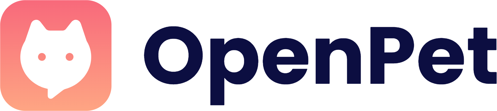
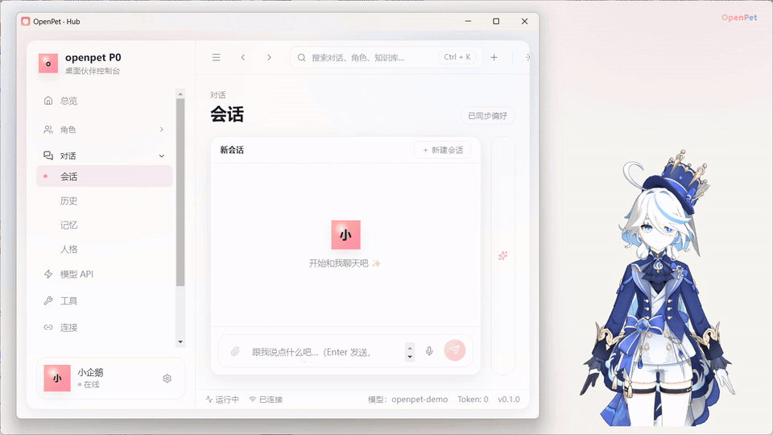
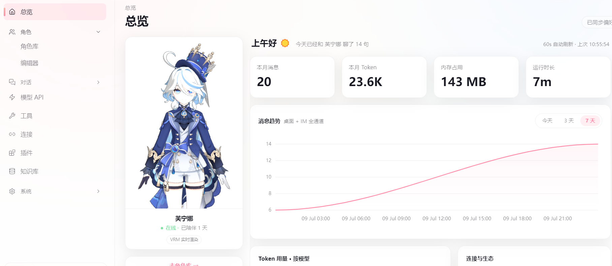
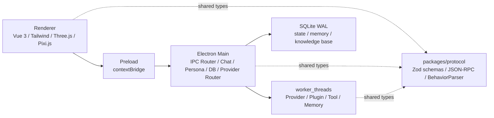

<div align="center">
  


  <p>
    一个桌面常驻的 AI 角色伙伴，让 AI 不只待在聊天窗口里，而是能被看见、能互动、会用表情和动作回应你。
  </p>

  <p>
    <a href="docs/user-manual.md">用户手册</a>
    ·
    <a href="apps/desktop/characters/default/README.md">角色包格式</a>
    ·
    <a href="packages/plugin-sdk/README.md">插件 SDK</a>
    ·
    <a href="https://github.com/Furina-he/OpenPet/releases">下载（Releases）</a>
  </p>

  <p>
    
    
    
    
    
  </p>
</div>

## 简介

OpenPet 是一个面向桌面的 AI 角色伙伴项目。它融合了桌宠、AI 对话、角色包、知识库和工具插件：角色可以常驻桌面，接收对话输入，在 AI 思考、回复、调用工具时做出即时的表情、动作和状态反馈。

它的核心目标是把“AI 助手”从一个窗口，变成一个有存在感的桌面伙伴。

## 📸 效果预览

<div align="center">
  
  <p><sub>真实录屏 —— 回复还在流式输出，角色表情已随行内 <code>&lt;emo:/&gt;</code> 标签实时变化；中途调用 MCP 工具 <code>get_weather</code>，参数、状态与结果回灌全程可见</sub></p>
</div>

<div align="center">
  
  <p><sub>Hub 总览 —— 左侧 VRM 角色实时渲染，右侧消息趋势、Token 用量与连接生态一屏总览</sub></p>
</div>

> 更多截图（桌面角色 / 聊天浮层 / 角色库）后续补充。

## ✨ 特性

- **桌面常驻角色**：透明桌面窗口、拖拽、触摸反馈、主动行为与桌面气泡。
- **VRM / Live2D 双运行时**：支持 3D 角色与 Live2D 角色，统一接收表情、动作、嘴型和行为事件。
- **流式行为驱动**：LLM 输出中的 `<emo />`、`<act />`、`<wait />` 和 intent header 会被增量解析，让文字回复和角色表现同步发生。
- **多模型 Provider**：支持多 Provider、多模型模板、降级链和动态配置表单。
- **Persona 与角色包**：可编辑人设、角色绑定、`.dspack` 导入、角色热切换和包内行为 cue 覆盖。
- **知识库与工具**：内置 SQLite 知识库、RAG 检索、MCP 工具授权、安全门和工具结果回灌。
- **语音交互**：支持自动朗读、语音输入和 RMS 嘴型驱动。
- **IM 通道**：QQ（OneBot v11 / NapCat）与 Telegram 桥接——同一个角色灵魂，桌面与 IM 多个入口。
- **插件系统**：Desktop 插件运行时（worker 沙箱 + 权限确认）+ AstrBot 插件兼容宿主。
- **本地优先**：配置、对话、记忆、角色与知识库数据优先保存在本地。

## 🚀 快速开始

环境要求：

- Node.js `>=20.11`
- pnpm `9.x`
- Windows 10 / 11

### 下载安装包

打包发布准备中——正式安装包（NSIS / portable）将在 [Releases](https://github.com/Furina-he/OpenPet/releases) 提供。

### 从源码运行

安装依赖并启动开发环境：

```bash
pnpm install
pnpm dev
```

只启动桌面应用：

```bash
pnpm --filter @openpet/desktop dev
```

常用命令：

```bash
pnpm typecheck
pnpm lint
pnpm test
pnpm build
```

## 🏗️ 架构



OpenPet 使用 Electron 作为桌面壳，业务大脑运行在 Main 进程，Renderer 负责 UI、桌面浮层和角色渲染。Provider、插件、工具和记忆相关任务运行在 `worker_threads` 中，避免复杂任务拖垮主进程。

跨进程协议由 `packages/protocol` 统一维护，Zod schema 是 Main、Renderer、Worker 之间的单一协议真源。

## 📁 仓库结构

```text
apps/
  desktop/            Electron 桌面壳：main / preload / renderer / tests
  sidecar/            JSON-RPC handleRequest 与 worker_threads 入口
  spikes/             技术实验
packages/
  protocol/           跨进程协议、Zod schema、行为解析器
  plugin-sdk/         插件作者 SDK
  tsconfig/           共享 TypeScript 配置
docs/                 用户手册与资源
```

## 📖 文档

- [用户手册](docs/user-manual.md)
- [角色包格式说明](apps/desktop/characters/default/README.md)
- [插件 SDK](packages/plugin-sdk/README.md)
- [Releases](https://github.com/Furina-he/OpenPet/releases)

## 🗺️ Roadmap

- [x] 桌面常驻角色：触摸反馈 / 拖拽物理 / 主动行为 / 桌面气泡
- [x] VRM 与 Live2D 双引擎角色渲染，角色包 `.dspack` 导入与热切换
- [x] 多 Provider 模型接入、降级链与预算控制
- [x] 语音：自动朗读 / 语音输入 / 嘴型同步
- [x] 长期记忆、知识库 RAG 与 MCP 工具
- [x] IM 通道：QQ（OneBot v11 / NapCat）、Telegram
- [x] 插件：Desktop 插件运行时 + AstrBot 插件兼容
- [x] 界面中英双语即时切换
- [ ] 安装包发布（NSIS / portable，进行中）

## 🤝 贡献

欢迎 Issue 与 PR：

- 提交信息遵循 Conventional Commits，例如 `feat:`、`fix:`、`docs:`、`refactor:`。
- 协议变更先改 `packages/protocol` 的 Zod schema（跨进程单一真源）。
- 提交前跑 `pnpm typecheck && pnpm lint && pnpm test` 全绿。

## 📄 License

[MIT](LICENSE)
