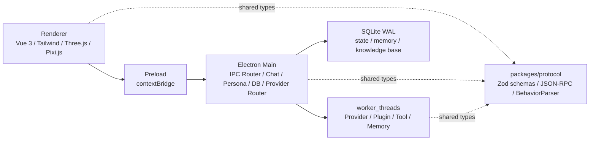

<div align="center">
  


  <p>
    一个桌面常驻的 AI 角色伙伴，让 AI 不只待在聊天窗口里，而是能被看见、能互动、会用表情和动作回应你。
  </p>

  <p>
    <a href="docs/user-manual.md">用户手册</a>
    ·
    <a href="apps/desktop/characters/default/README.md">角色包格式</a>
    ·
    <a href="packages/plugin-sdk/README.md">插件 SDK</a>
    ·
    <a href="https://github.com/Furina-he/OpenPet/releases">下载（Releases）</a>
  </p>

  <p>
    
    
    
    
    
  </p>
</div>

## 简介

OpenPet 是一个面向桌面的 AI 角色伙伴项目。它融合了桌宠、AI 对话、角色包、知识库和工具插件：角色可以常驻桌面，接收对话输入，在 AI 思考、回复、调用工具时做出即时的表情、动作和状态反馈。

它的核心目标是把“AI 助手”从一个窗口，变成一个有存在感的桌面伙伴。

## 📸 效果预览

<div align="center">
  
  <p><sub>真实录屏 —— 回复还在流式输出，角色表情已随行内 <code>&lt;emo:/&gt;</code> 标签实时变化；中途调用 MCP 工具 <code>get_weather</code>，参数、状态与结果回灌全程可见</sub></p>
</div>

<div align="center">
  
  <p><sub>Hub 总览 —— 左侧 VRM 角色实时渲染，右侧消息趋势、Token 用量与连接生态一屏总览</sub></p>
</div>

> 更多截图（桌面角色 / 聊天浮层 / 角色库）后续补充。

## ✨ 特性

- **桌面常驻角色**：透明桌面窗口、拖拽、触摸反馈、主动行为与桌面气泡。
- **VRM / Live2D 双运行时**：支持 3D 角色与 Live2D 角色，统一接收表情、动作、嘴型和行为事件。
- **流式行为驱动**：LLM 输出中的 `<emo />`、`<act />`、`<wait />` 和 intent header 会被增量解析，让文字回复和角色表现同步发生。
- **多模型 Provider**：支持多 Provider、多模型模板、降级链和动态配置表单。
- **Persona 与角色包**：可编辑人设、角色绑定、`.dspack` 导入、角色热切换和包内行为 cue 覆盖。
- **知识库与工具**：内置 SQLite 知识库、RAG 检索、MCP 工具授权、安全门和工具结果回灌。
- **语音交互**：支持自动朗读、语音输入和 RMS 嘴型驱动。
- **IM 通道**：QQ（OneBot v11 / NapCat）与 Telegram 桥接——同一个角色灵魂，桌面与 IM 多个入口。
- **插件系统**：Desktop 插件运行时（worker 沙箱 + 权限确认）+ AstrBot 插件兼容宿主。
- **本地优先**：配置、对话、记忆、角色与知识库数据优先保存在本地。

## 🚀 快速开始

环境要求：

- Node.js `>=20.11`
- pnpm `9.x`
- Windows 10 / 11

### 下载安装包

打包发布准备中——正式安装包（NSIS / portable）将在 [Releases](https://github.com/Furina-he/OpenPet/releases) 提供。

### 从源码运行

安装依赖并启动开发环境：

```bash
pnpm install
pnpm dev
```

只启动桌面应用：

```bash
pnpm --filter @openpet/desktop dev
```

常用命令：

```bash
pnpm typecheck
pnpm lint
pnpm test
pnpm build
```

## 🏗️ 架构


```mermaid
flowchart LR
  Renderer["Renderer\nVue 3 / Tailwind / Three.js / Pixi.js"]
  Preload["Preload\ncontextBridge"]
  Main["Electron Main\nIPC Router / Chat / Persona / DB / Provider Router"]
  Worker["worker_threads\nProvider / Plugin / Tool / Memory"]
  Protocol["packages/protocol\nZod schemas / JSON-RPC / BehaviorParser"]
  SQLite["SQLite WAL\nstate / memory / knowledge base"]

  Renderer --> Preload
  Preload --> Main
  Main --> Worker
  Main --> SQLite
  Renderer -. shared types .-> Protocol
  Main -. shared types .-> Protocol
  Worker -. shared types .-> Protocol
```

OpenPet 使用 Electron 作为桌面壳，业务大脑运行在 Main 进程，Renderer 负责 UI、桌面浮层和角色渲染。Provider、插件、工具和记忆相关任务运行在 `worker_threads` 中，避免复杂任务拖垮主进程。

跨进程协议由 `packages/protocol` 统一维护，Zod schema 是 Main、Renderer、Worker 之间的单一协议真源。

## 📁 仓库结构

```text
apps/
  desktop/            Electron 桌面壳：main / preload / renderer / tests
  sidecar/            JSON-RPC handleRequest 与 worker_threads 入口
  spikes/             技术实验
packages/
  protocol/           跨进程协议、Zod schema、行为解析器
  plugin-sdk/         插件作者 SDK
  tsconfig/           共享 TypeScript 配置
docs/                 用户手册与资源
```

## 📖 文档

- [用户手册](docs/user-manual.md)
- [角色包格式说明](apps/desktop/characters/default/README.md)
- [插件 SDK](packages/plugin-sdk/README.md)
- [Releases](https://github.com/Furina-he/OpenPet/releases)

## 🗺️ Roadmap

> **北极星**：让 AI 角色像真正的伙伴一样常驻桌面——**被看见、能交流、有反应、可扩展、属于社区**。
> **角色三层模型**：一个角色 = **灵魂**（怎么说话：人设 / 记忆 / 世界设定）+ **肉体**（怎么动：VRM / Live2D 形象与动作）+ **声音**（怎么响：音色）。三层可分别流通、自由组合，是整个路线图的骨架。

### 总览


```mermaid
flowchart LR
  classDef done fill:#DDF3E4,stroke:#2E8B57,color:#1B4332
  classDef active fill:#FFF1CC,stroke:#D4A017,color:#5C4300
  classDef plan fill:#EEF0F3,stroke:#8A94A6,color:#3B4252,stroke-dasharray: 5 5

  P0["<b>P0 内核 MVP</b><br/>桌面透明窗口 · VRM 渲染<br/>流式行为协议 · 多 Provider<br/>Hub 设置面板 · 聊天浮层"]:::done
  P1["<b>P1 AI 内核</b><br/>Provider 工作台 · 动态配置<br/>Hub 完整会话 · MCP 工具安全门<br/>知识库 RAG"]:::done
  P2["<b>P2 生命感与语音</b><br/>触摸分级 · 拖拽物理 · 心情连续性<br/>主动行为 · 工作状态外化<br/>TTS / ASR / 嘴型 · 人设管理 · Trace"]:::done
  P3["<b>P3 角色生态</b><br/>.dspack 角色包 · Live2D 双引擎<br/>角色编辑器 · 音色工坊<br/>.dssoul 灵魂包 · .dsbody 形象包<br/>角色市场 · 一键换形象"]:::done
  P4["<b>P4 连接生态</b><br/>QQ / Telegram 通道<br/>插件双运行时 · 会话管理<br/>总览仪表盘"]:::done
  P5["<b>P5 拟人与记忆 v1</b><br/>拟人化对话 · 表情分类兜底<br/>事实生命周期 · 会话滚动摘要<br/>世界设定 · 提示词宏"]:::done
  P6["<b>P6 打磨与发布基建</b><br/>中英双语 · 无障碍 · 性能埋点<br/>安装器 · 自动更新 · 发布流水线"]:::done
  P7["<b>P7 生命感 v2 · 记忆 v2</b><br/>身体分层模型 · 视线状态机<br/>节拍手势 · 心情贯穿三层<br/>角色 wiki 记忆 · 可编辑档案"]:::active
  P8["<b>P8 候选</b><br/>精灵图第三引擎<br/>音素级嘴型 · 市场内容扩充<br/>正式发布 v0.1.0"]:::plan

  P0 --> P1 --> P2 --> P3 --> P4 --> P5 --> P6 --> P7 --> P8
```

<div align="center"><sub>🟩 已完成 · 🟨 进行中 · ⬜ 候选（虚线）</sub></div>

### 里程碑明细

| 阶段 | 内容 | 状态 |
| --- | --- | --- |
| **P0 内核 MVP** | 透明置顶桌面窗口 / 点击穿透 / 托盘与热键 · VRM 角色渲染与 LookAt · 流式行为协议（`<emo/>` `<act/>` `<wait/>` + intent）· 多 Provider 与降级链 · SQLite 状态与会话 · Hub 设置面板 · 聊天浮层 · 引导流程 | ✅ 2026-06 |
| **P1 AI 内核** | Provider 两层 Source + Model 工作台（55+ 具名模板）· 动态配置表单 · Hub 完整会话（推理侧栏 / 工具卡）· MCP 工具授权与安全门 · 知识库 RAG（PDF / rerank / 缓存） | ✅ 2026-06 |
| **P2 生命感与语音** | 声明式交互 cue 表（角色包可覆盖）· 单击 / 连击 / 长按 / 抚摸分级 · 拖拽拎起摆动与回弹 · 心情 2h 半衰连续性 · 主动行为策略与勿扰 · 思考 / 查工具 / 出错 / 打瞌睡等工作状态外化 · 自动朗读 + 语音输入 + RMS 嘴型 · 可编辑人设 · 全链路 Trace 诊断 | ✅ 2026-07 |
| **P3 角色生态** | `.dspack` 安全导入与热切换 · Live2D（Cubism 4/5）第二运行时 · 角色编辑器 · 音色工坊（预设 / 文字设计 / 参考音频克隆）· `.dssoul` 灵魂包 · `.dsbody` 形象包与一键换形象（记忆 / 会话原地保留）· 零服务器静态索引角色市场（首批内容已上线） | ✅ 2026-09 |
| **P4 连接生态** | QQ（OneBot v11 / NapCat）与 Telegram 通道 · Desktop 插件 worker 沙箱 + AstrBot 插件兼容宿主 · 多会话管理与导出 · Hub 总览仪表盘 | ✅ 2026-07 |
| **P5 拟人与记忆 v1** | 风格锚 / 自然节奏分段 / 口癖规则 / 时间感 · 模型不吐标签时的表情分类兜底 · 长期记忆事实生命周期（增 / 改 / 删）· 会话滚动摘要 · 世界设定关键词注入 · 提示词宏 · 杂务模型独立配置 | ✅ 2026-07 |
| **P6 打磨与发布基建** | 中英双语即时切换 · 无障碍精简包 · 性能埋点与用户手册 · NSIS 安装器（自定义路径）· electron-updater 自动更新 · GitHub Releases 流水线 | ✅ 2026-07（正式发布暂缓，先打磨） |
| **P7 生命感 v2** | 身体分层模型（呼吸 / 微动 / 重心底噪 + 情绪姿态 + 动作预备与余震）· 表情快起慢退到心情基线 · 视线状态机（追踪 / 游移 / 思考 / 说话）· 动作协同（点头压视线、叹气半合眼）· 空闲行为序列 · 回复分段驱动的节拍手势 · 心情贯穿语气与语速 · VRMA 动画片段通道 · Live2D 对齐 | 🟨 进行中 |
| **P7 记忆 v2** | 记忆从扁平句子升级为可读可编辑的 markdown 角色 wiki：用户档案跨角色共享、关系与共同经历按角色隔离 · 常驻 + 关键词 + 向量三路注入 · LLM 作为编译器受控维护页面 · 旧记忆一次性整理迁移 · Hub 记忆页升级为 wiki 浏览器 | 🟨 进行中 |
| **P8 候选** | 精灵图第三引擎（像素图集形象，图像生成即可量产）· 音素级嘴型（TTS 时间戳对齐）· 角色市场内容扩充 · 正式发布 v0.1.0 · macOS / Linux 评估 | ⬜ 未排期 |

## 🤝 贡献

欢迎 Issue 与 PR：

- 提交信息遵循 Conventional Commits，例如 `feat:`、`fix:`、`docs:`、`refactor:`。
- 协议变更先改 `packages/protocol` 的 Zod schema（跨进程单一真源）。
- 提交前跑 `pnpm typecheck && pnpm lint && pnpm test` 全绿。

## 📄 License

[MIT](LICENSE)
