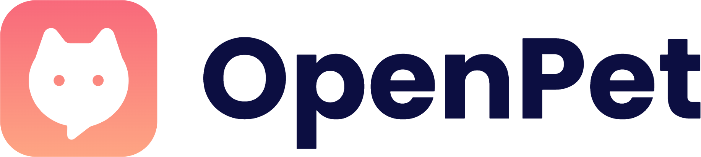
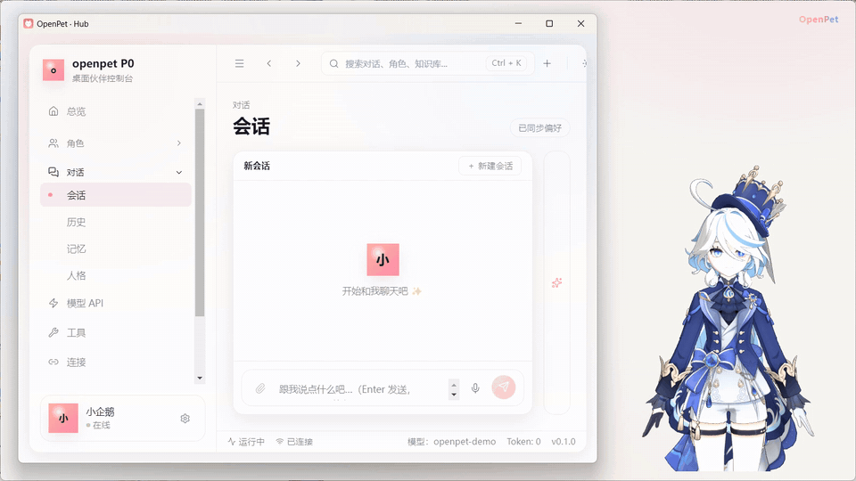
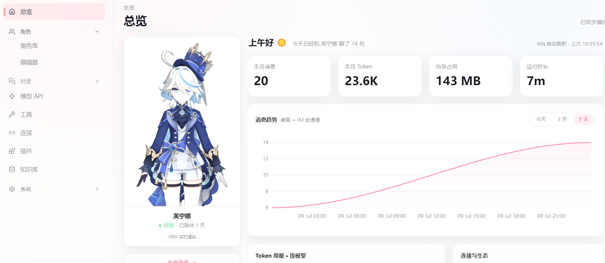
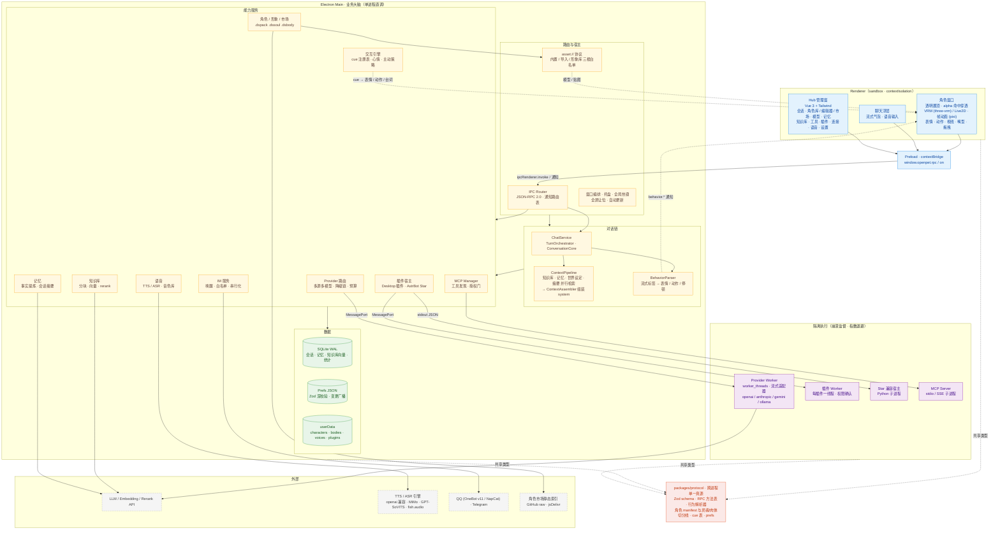
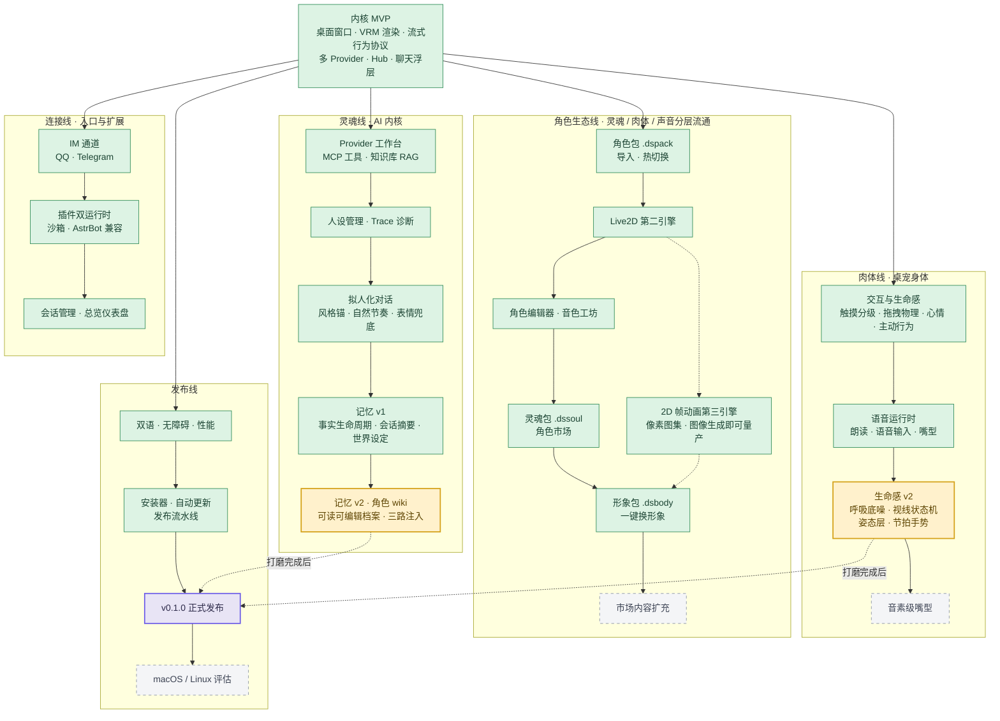

<div align="center">
  


  <p>
    一个桌面常驻的 AI 角色伙伴，让 AI 不只待在聊天窗口里，而是能被看见、能互动、会用表情和动作回应你。
  </p>

  <p>
    <a href="docs/user-manual.md">用户手册</a>
    ·
    <a href="apps/desktop/characters/default/README.md">角色包格式</a>
    ·
    <a href="packages/plugin-sdk/README.md">插件 SDK</a>
    ·
    <a href="https://github.com/Furina-he/OpenPet/releases">下载（Releases）</a>
  </p>

  <p>
    
    
    
    
    
  </p>
</div>

## 简介

OpenPet 是一个面向桌面的 AI 角色伙伴项目。它融合了桌宠、AI 对话、角色包、知识库和工具插件：角色可以常驻桌面，接收对话输入，在 AI 思考、回复、调用工具时做出即时的表情、动作和状态反馈。

它的核心目标是把“AI 助手”从一个窗口，变成一个有存在感的桌面伙伴。

## 📸 效果预览

<div align="center">
  
  <p><sub>真实录屏 —— 回复还在流式输出，角色表情已随行内 <code>&lt;emo:/&gt;</code> 标签实时变化；中途调用 MCP 工具 <code>get_weather</code>，参数、状态与结果回灌全程可见</sub></p>
</div>

<div align="center">
  
  <p><sub>Hub 总览 —— 左侧 VRM 角色实时渲染，右侧消息趋势、Token 用量与连接生态一屏总览</sub></p>
</div>

> 更多截图（桌面角色 / 聊天浮层 / 角色库）后续补充。

## ✨ 特性

- **桌面常驻角色**：透明桌面窗口、拖拽、触摸反馈、主动行为与桌面气泡。
- **VRM / Live2D / 帧动画三种形象**：3D 角色、Live2D 角色与 2D 逐帧图集（像素风、手绘风皆可，兼容 Codex 宠物图集）统一接收表情、动作、嘴型和行为事件；换形象可跨三类，记忆与人设原地保留。
- **流式行为驱动**：LLM 输出中的 `<emo />`、`<act />`、`<wait />` 和 intent header 会被增量解析，让文字回复和角色表现同步发生。
- **多模型 Provider**：支持多 Provider、多模型模板、降级链和动态配置表单。
- **Persona 与角色包**：可编辑人设、角色绑定、`.dspack` 导入、角色热切换和包内行为 cue 覆盖。
- **知识库与工具**：内置 SQLite 知识库、RAG 检索、MCP 工具授权、安全门和工具结果回灌。
- **语音交互**：支持自动朗读、语音输入和 RMS 嘴型驱动。
- **IM 通道**：QQ（OneBot v11 / NapCat）与 Telegram 桥接——同一个角色灵魂，桌面与 IM 多个入口。
- **插件系统**：Desktop 插件运行时（worker 沙箱 + 权限确认）+ AstrBot 插件兼容宿主。
- **本地优先**：配置、对话、记忆、角色与知识库数据优先保存在本地。

## 🚀 快速开始

环境要求：

- Node.js `>=20.11`
- pnpm `9.x`
- Windows 10 / 11

### 下载安装包

打包发布准备中——正式安装包（NSIS / portable）将在 [Releases](https://github.com/Furina-he/OpenPet/releases) 提供。

### 从源码运行

安装依赖并启动开发环境：

```bash
pnpm install
pnpm dev
```

只启动桌面应用：

```bash
pnpm --filter @openpet/desktop dev
```

常用命令：

```bash
pnpm typecheck
pnpm lint
pnpm test
pnpm build
```

## 🏗️ 架构


```mermaid
flowchart TB
  classDef win fill:#E3F2FD,stroke:#1E88E5,color:#0D47A1
  classDef main fill:#FFF8E1,stroke:#F9A825,color:#5D4037
  classDef worker fill:#F3E5F5,stroke:#8E24AA,color:#4A148C
  classDef data fill:#E8F5E9,stroke:#43A047,color:#1B5E20
  classDef ext fill:#F5F5F5,stroke:#9E9E9E,color:#424242,stroke-dasharray: 4 4
  classDef proto fill:#FBE9E7,stroke:#E64A19,color:#BF360C

  subgraph R["Renderer（sandbox · contextIsolation）"]
    direction LR
    RC["角色窗口<br/>透明置顶 · alpha 命中穿透<br/>VRM (three-vrm) / Live2D · 帧动画 (pixi)<br/>表情 · 动作 · 视线 · 嘴型 · 拖拽"]:::win
    RO["聊天浮层<br/>流式气泡 · 语音输入"]:::win
    RH["Hub 管理窗<br/>Vue 3 + Tailwind<br/>会话 · 角色库 / 编辑器 / 市场 · 模型 · 记忆<br/>知识库 · 工具 · 插件 · 连接 · 语音 · 设置"]:::win
  end

  PRE["Preload · contextBridge<br/>window.openpet.rpc / on"]:::win

  subgraph M["Electron Main · 业务大脑（单进程直调）"]
    direction TB
    subgraph M1["路由与宿主"]
      direction LR
      IPC["IPC Router<br/>JSON-RPC 2.0 · 通知路由表"]:::main
      WIN["窗口编排 · 托盘 · 全局热键<br/>全屏让位 · 自动更新"]:::main
      ASSET["asset:// 协议<br/>内置 / 导入 / 形象库 三根白名单"]:::main
    end
    subgraph M2["对话链"]
      direction LR
      CS["ChatService<br/>TurnOrchestrator · ConversationCore"]:::main
      CP["ContextPipeline<br/>知识库 · 记忆 · 世界设定 · 摘要 并行检索<br/>→ ContextAssembler 组装 system"]:::main
      BP["BehaviorParser<br/>流式标签 → 表情 / 动作 / 停顿"]:::main
      CS --> CP
      CS --> BP
    end
    subgraph M3["能力服务"]
      direction LR
      PROV["Provider 路由<br/>多源多模型 · 降级链 · 预算"]:::main
      MCP["MCP Manager<br/>工具发现 · 授权门"]:::main
      KB["知识库<br/>分块 · 向量 · rerank"]:::main
      MEM["记忆<br/>事实提炼 · 会话摘要"]:::main
      VOICE["语音<br/>TTS / ASR · 音色库"]:::main
      CHAR["角色 / 形象 / 市场<br/>.dspack .dssoul .dsbody"]:::main
      INT["交互引擎<br/>cue 注册表 · 心情 · 主动策略"]:::main
      IM["IM 服务<br/>唤醒 · 白名单 · 串行化"]:::main
      PLUG["插件宿主<br/>Desktop 插件 · AstrBot Star"]:::main
    end
    subgraph M4["数据"]
      direction LR
      DB[("SQLite WAL<br/>会话 · 记忆 · 知识库向量 · 统计")]:::data
      PREFS[("Prefs JSON<br/>Zod 深校验 · 变更广播")]:::data
      FILES[("userData<br/>characters · bodies · voices · plugins")]:::data
    end
    M1 --> M2
    M2 --> M3
    M3 --> M4
  end

  subgraph W["隔离执行（崩溃监督 · 指数退避）"]
    direction LR
    PW["Provider Worker<br/>worker_threads · 流式适配器<br/>openai / anthropic / gemini / ollama"]:::worker
    DPW["插件 Worker<br/>每插件一线程 · 权限确认"]:::worker
    STAR["Star 兼容宿主<br/>Python 子进程"]:::worker
    MCPP["MCP Server<br/>stdio / SSE 子进程"]:::worker
  end

  subgraph X["外部"]
    direction LR
    LLM["LLM / Embedding / Rerank API"]:::ext
    TTS["TTS / ASR 引擎<br/>openai 兼容 · MiMo · GPT-SoVITS · fish.audio"]:::ext
    IMX["QQ (OneBot v11 / NapCat) · Telegram"]:::ext
    MKT["角色市场静态索引<br/>GitHub raw · jsDelivr"]:::ext
  end

  PROTO["packages/protocol · 跨进程单一真源<br/>Zod schema · RPC 方法表 · 行为解析器<br/>角色 manifest 与灵魂/肉体切分线 · cue 表 · prefs"]:::proto

  RC --> PRE
  RO --> PRE
  RH --> PRE
  PRE -- "ipcRenderer.invoke / 通知" --> IPC
  IPC --> CS
  IPC --> M3
  BP -. "behavior.* 通知" .-> RC
  INT -. "cue → 表情 / 动作 / 台词" .-> RC
  CHAR --> ASSET
  ASSET -. "模型 / 贴图" .-> RC

  PROV -- "MessagePort" --> PW
  PLUG -- "MessagePort" --> DPW
  PLUG -- "stdout JSON" --> STAR
  MCP --> MCPP
  PW --> LLM
  KB --> LLM
  MEM --> LLM
  VOICE --> TTS
  IM --> IMX
  CHAR --> MKT

  R -. "共享类型" .-> PROTO
  M -. "共享类型" .-> PROTO
  W -. "共享类型" .-> PROTO
```

**一条消息的旅程**：用户在浮层或 Hub 输入 → Preload 经 JSON-RPC 送到 Main 的 IPC Router → ChatService 开一轮，ContextPipeline 并行检索知识库 / 记忆 / 世界设定 / 会话摘要并组装 system prompt → Provider Worker 流式调用模型 → 每个 token 块同时走两条轨：干净文本进气泡，`<emo/>` `<act/>` 等标签经 BehaviorParser 实时驱动角色窗口的表情与动作 → 模型请求工具时经 MCP 授权门执行并回灌 → 轮末异步提炼记忆、更新会话摘要、（可选）朗读。

**几条设计约束**：

- **Renderer 全部沙箱**：`sandbox` + `contextIsolation`，唯一 Node 能力是 Preload 暴露的 `window.openpet.rpc / on`；角色窗口是"哑播放器"，不含业务逻辑。
- **Main 是业务大脑但保持薄**：只做协议路由、Worker 调度、SQLite 单连接；Provider / 插件 / MCP / Python 宿主全部隔离执行，崩溃由监督者指数退避重启，密钥永不进 Worker。
- **三套协议互不混淆**：本地 IPC 用 JSON-RPC 2.0；LLM 输出用行为标签协议；插件用 `@openpet/plugin-sdk`。三者的 schema 都在 `packages/protocol` 以 Zod 定义，Main / Renderer / Worker 共享同一份类型。
- **一个角色 = 灵魂 + 肉体 + 声音**：切分线是 protocol 里的字段常量，灵魂包 `.dssoul`、形象包 `.dsbody` 与一键换形象读同一张表，换形象不换 characterId，记忆与会话原地保留。

## 📁 仓库结构

```text
apps/
  desktop/            Electron 桌面壳：main / preload / renderer / tests
  sidecar/            JSON-RPC handleRequest 与 worker_threads 入口
  spikes/             技术实验
packages/
  protocol/           跨进程协议、Zod schema、行为解析器
  plugin-sdk/         插件作者 SDK
  tsconfig/           共享 TypeScript 配置
docs/                 用户手册与资源
```

## 📖 文档

- [用户手册](docs/user-manual.md)
- [角色包格式说明](apps/desktop/characters/default/README.md)
- [插件 SDK](packages/plugin-sdk/README.md)
- [Releases](https://github.com/Furina-he/OpenPet/releases)

## 🗺️ Roadmap

> 一个角色 = **灵魂**（怎么说话）+ **肉体**（怎么动）+ **声音**（怎么响）。路线图围绕这三层展开：先把内核立起来，再分五条线并行推进，最后汇入正式发布。


```mermaid
flowchart TB
  classDef done fill:#DDF3E4,stroke:#2E8B57,color:#1B4332
  classDef active fill:#FFF1CC,stroke:#D4A017,color:#5C4300,stroke-width:2px
  classDef plan fill:#F4F5F7,stroke:#8A94A6,color:#3B4252,stroke-dasharray: 5 5
  classDef gate fill:#E8E4F5,stroke:#6C5CE7,color:#2D2A4A,stroke-width:2px

  MVP["内核 MVP<br/>桌面窗口 · VRM 渲染 · 流式行为协议<br/>多 Provider · Hub · 聊天浮层"]:::done

  subgraph BODY["肉体线 · 桌宠身体"]
    direction TB
    B1["交互与生命感<br/>触摸分级 · 拖拽物理 · 心情 · 主动行为"]:::done
    B2["语音运行时<br/>朗读 · 语音输入 · 嘴型"]:::done
    B3["生命感 v2<br/>呼吸底噪 · 视线状态机<br/>姿态层 · 节拍手势"]:::active
    B5["音素级嘴型"]:::plan
    B1 --> B2 --> B3
    B3 --> B5
  end

  subgraph SOUL["灵魂线 · AI 内核"]
    direction TB
    S1["Provider 工作台<br/>MCP 工具 · 知识库 RAG"]:::done
    S2["人设管理 · Trace 诊断"]:::done
    S3["拟人化对话<br/>风格锚 · 自然节奏 · 表情兜底"]:::done
    S4["记忆 v1<br/>事实生命周期 · 会话摘要 · 世界设定"]:::done
    S5["记忆 v2 · 角色 wiki<br/>可读可编辑档案 · 三路注入"]:::active
    S1 --> S2 --> S3 --> S4 --> S5
  end

  subgraph ECO["角色生态线 · 灵魂 / 肉体 / 声音分层流通"]
    direction TB
    E1["角色包 .dspack<br/>导入 · 热切换"]:::done
    E2["Live2D 第二引擎"]:::done
    E7["2D 帧动画第三引擎<br/>像素图集 · 图像生成即可量产"]:::done
    E3["角色编辑器 · 音色工坊"]:::done
    E4["灵魂包 .dssoul<br/>角色市场"]:::done
    E5["形象包 .dsbody<br/>一键换形象"]:::done
    E6["市场内容扩充"]:::plan
    E1 --> E2 --> E3 --> E4 --> E5 --> E6
    E2 -.-> E7
    E7 -.-> E5
  end

  subgraph LINK["连接线 · 入口与扩展"]
    direction TB
    L1["IM 通道<br/>QQ · Telegram"]:::done
    L2["插件双运行时<br/>沙箱 · AstrBot 兼容"]:::done
    L3["会话管理 · 总览仪表盘"]:::done
    L1 --> L2 --> L3
  end

  subgraph SHIP["发布线"]
    direction TB
    R1["双语 · 无障碍 · 性能"]:::done
    R2["安装器 · 自动更新<br/>发布流水线"]:::done
    R3["v0.1.0 正式发布"]:::gate
    R4["macOS / Linux 评估"]:::plan
    R1 --> R2 --> R3 --> R4
  end

  MVP --> B1
  MVP --> S1
  MVP --> E1
  MVP --> L1
  MVP --> R1
  B3 -.打磨完成后.-> R3
  S5 -.打磨完成后.-> R3
```

<div align="center"><sub>🟩 已完成 · 🟨 进行中 · ⬜ 候选 · 🟪 发布门</sub></div>

## 🤝 贡献

欢迎 Issue 与 PR：

- 提交信息遵循 Conventional Commits，例如 `feat:`、`fix:`、`docs:`、`refactor:`。
- 协议变更先改 `packages/protocol` 的 Zod schema（跨进程单一真源）。
- 提交前跑 `pnpm typecheck && pnpm lint && pnpm test` 全绿。

## 📄 License

[MIT](LICENSE)
